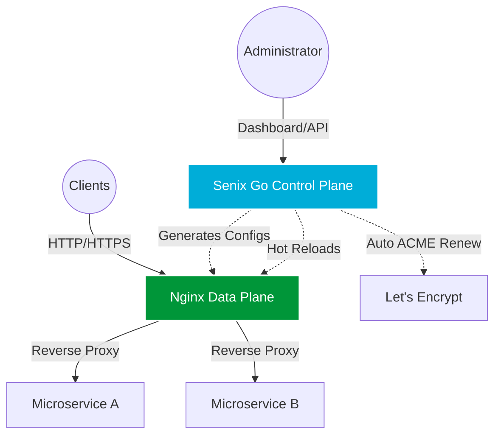

<div align="center">
  
  
  # Senix Gateway
  
  **The Next-Generation Nginx Control Plane & API Gateway**

  [](https://golang.org/)
  [](https://reactjs.org/)
  [](https://github.com/ALVIN-YANG/senix/actions/workflows/backend.yml)
  [](https://github.com/ALVIN-YANG/senix/actions/workflows/frontend.yml)
  [](https://opensource.org/licenses/Apache-2.0)
  [](https://nginx.org/)

  [Documentation](https://github.com/ALVIN-YANG/senix/wiki) • 
  [Installation](#quick-start) • 
  [Features](#core-features) • 
  [Contributing](#contributing)
</div>

---

## ⚡ Overview

Senix is a blazingly fast, modern, and highly scalable API Gateway built on top of the rock-solid **Nginx** data plane, managed by an intelligent **Go-based** control plane, and visualized through a cutting-edge **React 18** dashboard.

It is designed for the modern web (circa 2026), providing zero-downtime reloads, built-in Let's Encrypt automation, and enterprise-grade WAF (Web Application Firewall) capabilities out of the box.

## ✨ Core Features

* 🚀 **Zero-Overhead Performance**: Leverages native Nginx for handling data traffic, meaning 0 latency penalty.
* 🔐 **Automated SSL/TLS**: Native ACME integration via `lego`. Get and auto-renew Let's Encrypt certificates instantly.
* 🛡️ **Enterprise WAF Security**: Built-in support for Coraza WAF to protect against SQLi, XSS, and modern OWASP Top 10 vulnerabilities.
* 🌐 **Dynamic Configurations**: API-driven Nginx configuration generation with hot-reloading.
* 📊 **Modern Premium UI**: A beautifully crafted dashboard utilizing React + shadcn-ui & TailwindCSS with top-tier Feishu/Lark inspired UX.
* ⚡ **Traffic Control**: Out-of-the-box Rate Limiting and IP Blacklisting mechanisms.
* 🤖 **Self-Management**: Senix automatically manages its own web console configuration natively.
* ✅ **Continuous Integration**: Built-in GitHub Actions workflows for automated testing and builds.

## 📋 Implemented Features Matrix

| Category | Feature | Status |
| :--- | :--- | :---: |
| **Data Plane** | Nginx Reverse Proxy | ✅ |
| | Standalone & ConfigOnly Modes | ✅ |
| | Automatic Nginx Reloads | ✅ |
| **Control Plane** | Core REST API (Sites, Certs) | ✅ |
| | JWT Authentication | ✅ |
| | User Role Management | ✅ |
| | Initial Admin Provisioning | ✅ |
| | Scheduled Cron Tasks (Cert Renewal) | ✅ |
| **Security** | Let's Encrypt ACME DNS-01 / HTTP-01 | ✅ |
| | Bcrypt Password Hashing | ✅ |
| | WAF / ModSecurity Integration | ⏳ (WIP) |
| **Frontend** | Modern Dashboard (React 18) | ✅ |
| | Sites & Certs Management UI | ✅ |
| | State Management (Zustand) | ✅ |
| **DevOps** | Systemd Install/Uninstall Scripts | ✅ |
| | CI/CD (GitHub Actions) | ✅ |

## 🏗️ Architecture

Senix decouples the Data Plane from the Control Plane for maximum resilience:



## 🚀 Quick Start

### One-Line Install (Recommended for Linux)
For Ubuntu/Debian based systems, we provide an enterprise-grade automated installer:

```bash
sudo curl -sSL https://raw.githubusercontent.com/ALVIN-YANG/senix/main/install.sh | sudo bash
```
*Note: This will install Nginx, Certbot, Senix Control Plane and set up the Systemd services automatically.*

### Docker Compose
```bash
git clone https://github.com/ALVIN-YANG/senix.git
cd senix
docker-compose up -d
```

### Accessing the Dashboard
Once deployed, open your browser and navigate to:
```
http://<your-server-ip>:8080
```
**Default Credentials:**
* **Username:** `admin`
* **Password:** `admin123`

## 🛠️ Tech Stack

| Component | Technology | Description |
| :--- | :--- | :--- |
| **Data Plane** | Nginx | Handles all reverse proxying and traffic routing. |
| **Control Plane** | Go 1.22, Gin, GORM | High-concurrency backend API for configuration state. |
| **Frontend** | React 18, Vite, shadcn-ui & TailwindCSS | 2026-level modern SPA dashboard. |
| **Database** | SQLite / PostgreSQL | Robust storage for configurations and users. |
| **Certificates** | lego | Go-based ACME client for seamless SSL. |

## 📜 License

This project is licensed under the [Apache License 2.0](LICENSE).

## 🙏 Acknowledgements

* [Nginx](https://nginx.org/)
* [Go-ACME/Lego](https://github.com/go-acme/lego)
* [Coraza WAF](https://coraza.io/)
