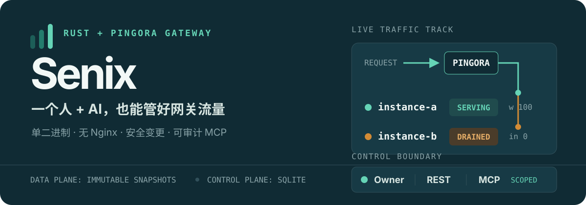
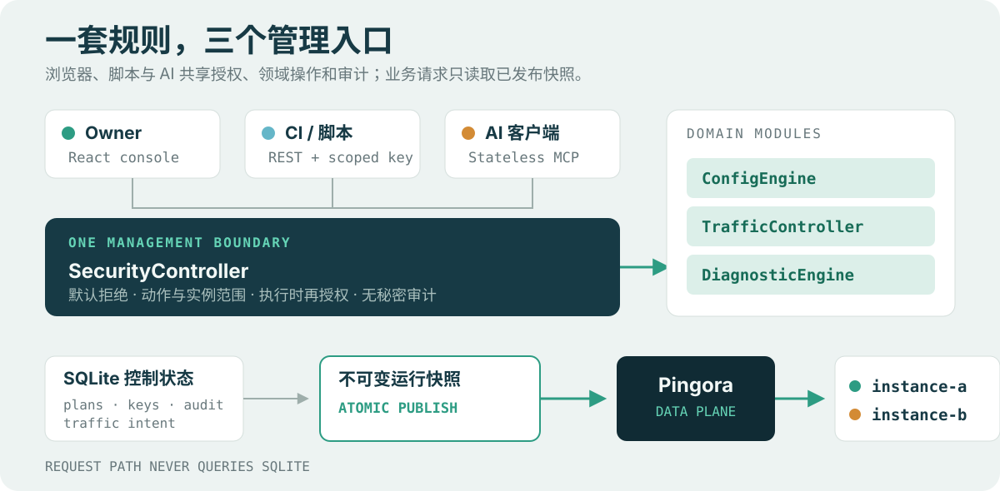

<p align="center">
  
</p>

<p align="center">
  
  
  <a href="https://github.com/ALVIN-YANG/senix/releases"></a>
  
</p>

Senix 是一个面向个人开发者和小团队的独立 Rust 网关。一个二进制同时承载 Pingora 数据面、SQLite 控制面、REST、无会话 MCP 和嵌入式管理后台，不依赖 Nginx 或外部数据库。它管理安全变更、实例流量和诊断证据；SSH、Docker、Kubernetes 和实际部署仍由用户或外部脚本控制。

> [!IMPORTANT]
> 当前是可运行的 `v0.1` 纵切，不是完整生产发布版。已经实现的能力和暂不支持的范围都列在下方。

## 已经能做什么

| 场景 | 当前实现 |
| --- | --- |
| 代理流量 | Pingora HTTP 代理、平滑加权轮询、HTTP/TCP 主动健康检查 |
| 滚动部署配合 | 持久化摘流、在途请求查询、超时状态、新代次回接、权重调整、明确禁用 |
| 安全改配置 | 不可修改的 Change Plan、结构化差异、15 分钟 Owner 批准、原子 Snapshot 发布、回滚计划 |
| 一个人管理 | Owner 控制台、受限 API Key、操作审计、实例维护控制舱、请求证据链 |
| AI 协作 | 无会话 Streamable HTTP MCP；工具按 Key 权限裁剪，调用时再次授权 |
| TLS 证书 | 静态 PEM、HTTP-01 手动签发、加密持久化、SNI 多证书、无重启热切换 |

## 怎么工作

<p align="center">
  
</p>

核心逻辑按领域拆成独立 Module：

- `ConfigEngine` 负责预检、差异、批准、发布与回滚计划。
- `TrafficController` 负责摘流、回接、权重、禁用、幂等和持久化。
- `GatewayRuntime` 负责不可变 Snapshot、请求选路和在途计数。
- `DiagnosticEngine` 从同一运行快照产生结构化证据，不从日志猜状态。
- `CertificateController` 加密保存账户凭据和证书私钥，Pingora 只读取已发布的证书快照。

更完整的产品边界见 [需求文档](./docs/requirements.md)，关键设计决定见 [ADR](./docs/adr)。

## 快速开始

有 Docker 时，直接启动一个 Senix 和两个演示后端：

```bash
git clone https://github.com/ALVIN-YANG/senix.git
cd senix
./scripts/demo.sh
```

脚本会生成 Owner 密码，并输出管理后台地址和一次真实代理结果。停止演示不会删除数据；执行输出中的重置命令才会清空演示卷。

只安装二进制时：

```bash
curl --proto '=https' --tlsv1.2 -LsSf \
  https://raw.githubusercontent.com/ALVIN-YANG/senix/main/install.sh | sh
```

安装器支持 Linux 和 macOS 的 x86_64、ARM64，下载 GitHub Release 并校验 SHA-256。Linux 需要 glibc 2.34 或更新版本；也可以先下载并检查 [`install.sh`](./install.sh) 再执行。

<details>
<summary><strong>从源码构建</strong></summary>

需要 Rust `1.88`、C/C++ 编译器和 CMake。示例配置假定本机已有两个 HTTP 后端，分别监听 `4101` 和 `4102`。

```bash
# macOS
brew install cmake

# Ubuntu / Debian
sudo apt-get install build-essential cmake

cargo build --release --locked -p senixd
```

第一次运行前，在服务器本机完成两步引导。

```bash
# 1. 建立一次性 Owner 引导凭据
cargo run -p senixd -- credential bootstrap \
  --db /tmp/senix.db \
  --label local-owner

# 2. 从标准输入创建唯一 Owner 账号
printf '%s' "$SENIX_OWNER_PASSWORD" | cargo run -p senixd -- owner bootstrap \
  --db /tmp/senix.db \
  --username admin \
  --password-stdin
```

账号创建成功后，一次性引导凭据会在同一个 SQLite 事务中失效。然后启动网关：

```bash
cargo run -p senixd -- \
  --listen 127.0.0.1:8080 \
  --admin-listen 127.0.0.1:9080 \
  --db /tmp/senix.db \
  --config examples/gateway.json
```

健康阈值通过后，验证代理和管理面：

```bash
curl -H 'Host: example.test' http://127.0.0.1:8080/
open http://127.0.0.1:9080/admin/
```

数据库为空时必须提供 `--config`。已有 Snapshot 时，Senix 从 SQLite 恢复最新版本并忽略启动配置，避免重启覆盖已经生效的状态。

已有 PEM 证书时，可以让同一个数据面同时监听 HTTP 和 HTTPS：

```bash
senixd \
  --listen 0.0.0.0:80 \
  --tls-listen 0.0.0.0:443 \
  --tls-cert /etc/senix/tls/fullchain.pem \
  --tls-key /etc/senix/tls/privkey.pem \
  --admin-listen 127.0.0.1:9080 \
  --db /var/lib/senix/senix.db \
  --config /etc/senix/gateway.json
```

`--tls-cert` 与 `--tls-key` 必须一起提供。证书会在启动时完整校验，并作为默认 SNI 证书加载。

使用 ACME HTTP-01 时，先生成独立于数据库的主密钥文件：

```bash
sudo install -d -m 700 /etc/senix
senixd secret-key generate --output /etc/senix/secret.key

senixd \
  --listen 0.0.0.0:80 \
  --tls-listen 0.0.0.0:443 \
  --secret-key-file /etc/senix/secret.key \
  --acme-directory-url https://acme-v02.api.letsencrypt.org/directory \
  --acme-contact mailto:ops@example.com \
  --acme-accept-terms \
  --admin-listen 127.0.0.1:9080 \
  --db /var/lib/senix/senix.db \
  --config /etc/senix/gateway.json
```

域名解析到这个 HTTP 入口后，可在管理后台手动签发，也可由脚本调用：

```bash
curl -X POST \
  -H "Authorization: Bearer $SENIX_API_KEY" \
  -H 'Content-Type: application/json' \
  -d '{"domains":["api.example.com"],"timeout_seconds":90}' \
  http://127.0.0.1:9080/api/v1/certificates/issue
```

API Key 需要全局 `certificate.issue` 权限。ACME 账户和证书私钥使用主密钥加密后写入 SQLite；签发成功会原子切换 SNI 证书，不重启网关。当前不会自行安排续期，仍由用户或脚本触发。

</details>

<details>
<summary><strong>使用 Docker 构建和运行</strong></summary>

```bash
docker build -t senix:dev .

docker run --rm \
  -v senix-data:/var/lib/senix \
  senix:dev credential bootstrap \
  --db /var/lib/senix/senix.db \
  --label local-owner

printf '%s' "$SENIX_OWNER_PASSWORD" | docker run --rm -i \
  -v senix-data:/var/lib/senix \
  senix:dev owner bootstrap \
  --db /var/lib/senix/senix.db \
  --username admin \
  --password-stdin

docker run --rm \
  -p 8080:8080 \
  -p 127.0.0.1:9080:9080 \
  -v "$PWD/gateway.json:/etc/senix/gateway.json:ro" \
  -v senix-data:/var/lib/senix \
  senix:dev
```

容器以非 root 用户运行。`gateway.json` 中的后端地址必须能从容器网络访问，不能照搬宿主机的 `127.0.0.1`。

</details>

## 管理后台

后台静态资源嵌入 `senixd`，不需要部署第二个 Web 服务。Owner 登录后可以：

- 查看实例的流量状态、健康状态、权重和部署代次；
- 手动摘流、回接、调整权重或二次确认禁用实例；
- 编辑完整候选配置，核对差异和摘要后批准精确计划；
- 模拟 Host 与路径的选路结果，复制原始诊断 JSON；
- 创建最小权限 Key、吊销 Key，并查看无秘密审计记录。
- 查看证书有效期，手动发起 HTTP-01 签发并热切换。

最后一个可用后端和不健康实例回接不会被静默绕过。只有操作者显式选择 `force` 才能继续，操作会被标记为高风险。

修改前端后需重新生成嵌入产物：

```bash
cd web
npm ci --ignore-scripts
npm run build
```

## 配合外部脚本滚动部署

Senix 提供原子流量操作，不维护整套发布计划：

```text
drain(instance, timeout, idempotency_key)
  → poll(operation_id)
  → 外部脚本执行部署
  → rejoin(instance, new_generation, weight)
  → 外部脚本观察并调整权重
```

```bash
# 摘流：立即停止新请求，并返回 operation_id
curl -X POST \
  -H "Authorization: Bearer $SENIX_API_KEY" \
  -H 'Content-Type: application/json' \
  -H 'Idempotency-Key: deploy-42-drain-a' \
  -d '{"timeout_ms":60000,"force":false}' \
  http://127.0.0.1:9080/api/v1/instances/instance-a/drain

# 查询返回的摘流操作
curl -H "Authorization: Bearer $SENIX_API_KEY" \
  http://127.0.0.1:9080/api/v1/operations/OPERATION_ID

# 部署结束后，以新代次和 5% 权重回接
curl -X POST \
  -H "Authorization: Bearer $SENIX_API_KEY" \
  -H 'Content-Type: application/json' \
  -H 'Idempotency-Key: deploy-42-rejoin-a' \
  -d '{"generation":2,"weight":5,"force":false}' \
  http://127.0.0.1:9080/api/v1/instances/instance-a/rejoin
```

所有流量写操作都要求 `Idempotency-Key`。重复调用返回原操作结果，不会重新摘流当前代次。会让路由失去最后一个可用后端的摘流默认返回 `409 LAST_AVAILABLE_BACKEND`。

## 安全变更

配置不会从编辑器直接进入数据面：

1. 用户、脚本或 AI 创建不可修改的 Change Plan。
2. Senix 校验完整候选配置，生成差异和内容摘要。
3. 只有 Owner 可以批准这份精确内容，批准有效期为 15 分钟。
4. Owner 或带 `change.apply` 的 Key 应用已批准计划，发布新的不可变 Snapshot。
5. 回滚同样先生成计划，不绕过批准流程。

MCP 没有批准工具，也不能修改已生成计划。

## MCP 与权限

Streamable HTTP MCP 位于 `http://127.0.0.1:9080/mcp`。每个请求都使用管理后台生成的 Bearer Key；MCP 不接受浏览器 Cookie，也不保存协议会话。

当前工具覆盖实例查询与流量控制、请求诊断、配置与回滚规划、应用已批准计划和审计读取。

工具清单会按 Key 的动作和实例范围裁剪，实际调用仍会再次授权。MCP 不提供 Key 创建、计划批准、Shell、SSH、Docker 或 Kubernetes 工具。

默认只接受 `localhost`、`127.0.0.1` 和 `::1` 的 Host。通过私网域名访问时需要显式配置：

```bash
senixd \
  --mcp-allowed-host gateway.internal \
  --mcp-allowed-origin https://admin.example.com \
  --listen 127.0.0.1:8080 \
  --admin-listen 0.0.0.0:9080 \
  --db /var/lib/senix/senix.db \
  --config /etc/senix/gateway.json
```

## 安全边界

| 凭据 | 用途 | 保护 |
| --- | --- | --- |
| Owner Account | 浏览器管理后台 | Argon2id 密码、短期签名 Cookie、同源 CSRF 头 |
| API Key | REST 脚本与 MCP | 完整值只展示一次、服务端仅存摘要、动作与实例范围、有效期、撤销 |
| Secret Key File | ACME 账户与证书私钥 | 外部 `0600` 文件；SQLite 只保存 XChaCha20-Poly1305 密文 |

管理端口默认应只绑定本机或私网。当前未内置管理面 TLS，不要把 `9080` 直接暴露到公网；通过受信 TLS 入口访问时增加 `--admin-secure-cookie`。

审计记录操作者、动作、资源、结果和风险，不保存密码、Cookie、API Key、Authorization 头或完整请求体。

## 当前限制

- ACME 当前只支持 HTTP-01；DNS-01、自动续期、手动上传托管证书和到期告警尚未实现。
- WebSocket、SSE 和 gRPC 会单独计入长连接在途数；摘流超时只报告状态，不会强杀连接或迁移已有连接。
- 当前是单节点 SQLite 控制面，没有多节点一致性或网关集群管理。
- Service 还不是可授权的真实领域实体，Key 只支持全局或明确的 Instance 范围。
- 被动健康信号、MCP stdio 桥、插件 Adapter 和系统服务安装尚未实现。
- HTTP/3 不在当前 Pingora 数据面能力内。

详细取舍和后续候选范围见 [需求文档](./docs/requirements.md)。

## 仓库结构

```text
crates/senix-core      配置、流量、运行时、安全和诊断 Module
crates/senix-acme      HTTP-01 ACME 协议 Adapter
crates/senix-pingora   Pingora 数据面 Adapter
crates/senix-mcp       MCP Streamable HTTP Adapter
crates/senixd          单进程入口、健康检查、REST 与嵌入后台
web                    React 管理后台源码
docs                   需求与架构决策
examples               可运行配置
```

## 验证

```bash
cargo fmt --all -- --check
cargo clippy --workspace --all-targets --locked -- -D warnings
cargo test --workspace --locked
docker build --check .
```

端到端测试使用真实 HTTP/TLS 后端和 `senixd` 子进程，覆盖代理、流量控制、健康检查、鉴权、审计、MCP、批准应用及加密证书跨进程恢复。

## 参与开发

提交前请阅读 [CONTRIBUTING.md](./CONTRIBUTING.md) 和 [SECURITY.md](./SECURITY.md)。

## License

[Apache License 2.0](./LICENSE)
