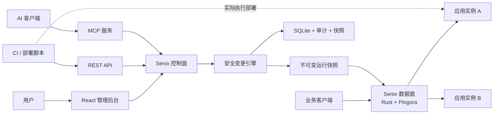
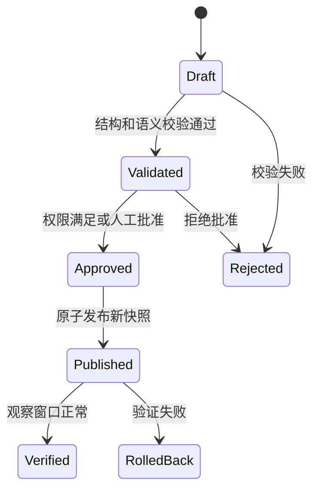
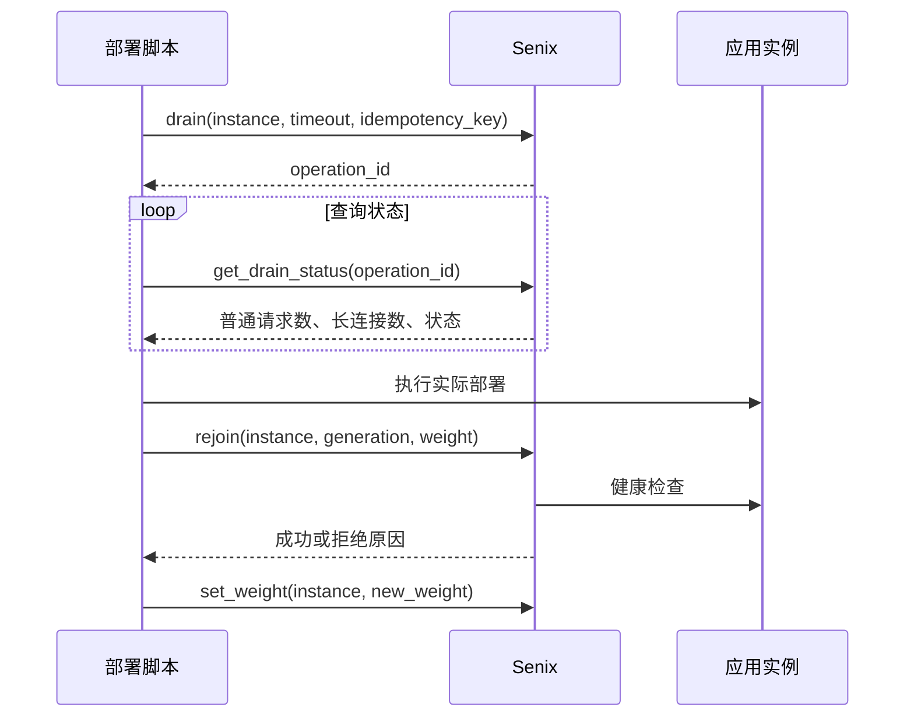

# Senix v2 产品需求文档

> 状态：需求边界已确认
> 日期：2026-08-11
> 目标版本：v0.1
> 许可证：Apache-2.0

## 1. 产品定义

Senix v2 是一个基于 Rust 和 Pingora 实现的独立网关。它不再依赖 Nginx，也不是 Pingora 或 Pingap 的插件。

产品面向个人开发者和 2～10 人的小团队。核心目标是让一个人配合 AI 客户端，安全完成网关配置、应用实例摘流、故障诊断和日常维护。

Senix 不负责执行 SSH、Shell、容器更新或业务部署。外部脚本、CI 或用户负责部署过程，Senix 只提供可靠、可审计的流量控制能力。

### 1.1 核心价值

Senix v2 优先实现四项中高创新能力：

1. **安全变更引擎**：所有配置修改都经过预检、差异确认、原子发布、结果验证和回滚。
2. **部署流量控制**：向脚本提供摘流、在途请求查询、回接、权重调整和禁用实例等原子操作。
3. **可解释诊断**：按入口、TLS、路由、后端选择、健康状态、连接和响应输出可验证的证据链。
4. **AI 安全控制面**：通过 MCP 和细粒度 Key 开放任务级工具，不让 AI 直接执行服务器命令或绕过安全流程。

HTTP 代理、负载均衡、自动证书和管理后台是产品成立所需的基础能力，不作为主要创新点宣传。

### 1.2 成功标准

- 用户不需要安装或维护 Nginx、Go 服务和外部数据库。
- 后台、CLI、REST 和 MCP 使用同一套配置校验、权限和审计规则。
- 部署脚本可以确定地摘除一个实例，等待普通请求结束，部署完成后再明确回接。
- 配置错误不会直接进入数据面；运行异常时可以恢复到上一份有效快照。
- 用户和 AI 看到相同的健康状态、流量状态与诊断证据。

## 2. 用户与使用场景

### 2.1 目标用户

- 在一台或少量 Linux 服务器上运行多个 Web 服务的个人开发者。
- 使用 Docker Compose、systemd 或简单 CI 脚本的小团队。
- 希望让 Codex、Claude Code 等 AI 客户端协助排障和运维，但不愿授予服务器 Shell 权限的用户。

### 2.2 主要场景

1. 创建服务、路由和后端池，自动配置 HTTPS。
2. 修改域名、路由或后端配置，预览差异后安全生效。
3. CI 在发布前摘流指定实例，发布后由脚本控制回接和灰度权重。
4. 域名无法访问时，按证据链定位失败环节。
5. AI 使用受限 Key 查询状态、诊断问题或执行服务范围内的可回滚操作。

## 3. 产品边界

### 3.1 v0.1 范围

- 单个 Rust 服务端二进制，内含数据面、控制面、REST、MCP 和管理后台静态资源。
- HTTP/HTTPS 反向代理和负载均衡。
- 服务、路由、后端池、实例与健康检查。
- ACME 自动证书和手动证书管理。
- 安全变更、不可变快照、验证与回滚。
- 实例摘流、状态查询、回接、权重调整和禁用。
- 本地诊断、近期指标、审计和数据导出。
- 所有者账号、细粒度 API Key 和操作批准。
- Linux 单文件、Docker 镜像和 systemd 安装方式。

### 3.2 v0.2 候选范围

- Docker 标签自动发现。
- 旧版 Senix 数据和常见 Nginx 配置的一次性导入工具。
- 认证、服务发现、事件通知和遥测等外部适配器示例。
- 插件清单校验、版本协商和适配器健康状态。

### 3.3 明确不做

- Nginx 配置生成模式或 Nginx 兼容运行时。
- WAF、API 计费、完整身份平台和服务网格。
- 自动执行 SSH、Shell、Docker 或 Kubernetes 发布命令。
- 由 Senix 编排整个服务的实例发布顺序。
- 自动判断灰度成功或自动扩大新实例流量。
- v0.1 内置 Kubernetes 控制器、多节点控制面或网关集群管理。
- v0.1 蓝绿发布、流量镜像、WASM 插件市场和任意 Rust 动态库加载。

## 4. 系统边界与架构



### 4.1 “无状态”的定义

- **数据面无状态**：代理请求不依赖本地用户会话或可变配置对象；请求使用已发布的不可变运行快照。
- **控制面有状态**：SQLite 持久化配置、Key 摘要、审计、快照和实例期望流量状态。
- 实例处于摘流或禁用状态时，Senix 重启后必须保持该状态，不能自动恢复流量。
- v0.1 的唯一可信状态位于本机 SQLite；YAML 是导入、规划和导出格式，不直接作为运行时状态源。

### 4.2 进程与端口

- 单个 `senix` 二进制承载代理、控制 API、MCP 和嵌入式管理后台。
- 公共数据面默认监听 `80/443`。
- 管理面使用独立端口，默认只允许本机或私网访问。
- 管理面如需公网开放，必须显式启用 TLS 和访问限制。
- 管理面故障不得主动修改已经发布的数据面快照。

### 4.3 首版拓扑

- v0.1 以单个 Senix 网关管理多个应用实例为目标。
- 数据面设计不得依赖单节点专有会话，为以后多网关节点留下同步接口。
- v0.1 不宣称 Senix 网关自身具备节点级高可用。

## 5. 核心领域模型

| 对象 | 含义 | 主要关系 |
| --- | --- | --- |
| Service | 一个可独立管理和授权的业务服务 | 包含多个 Route |
| Route | 将入口请求匹配到后端池的规则 | 属于 Service，指向 BackendPool |
| BackendPool | 一组可承载同类请求的后端 | 包含多个 Instance |
| Instance | 一个实际后端地址 | 具有稳定 ID、部署代次、权重和状态 |
| Certificate | TLS 证书及其生命周期信息 | 被一个或多个 Route 引用 |
| Change Plan | 绑定当前 Snapshot 的不可修改配置提案 | 批准后生成一个新 Snapshot |
| Snapshot | 数据面使用的不可变配置版本 | 原子替换上一版本 |
| Operation | 摘流、回接等长操作的执行记录 | 支持幂等、查询和审计 |
| Credential | 所有者身份或受限 API Key | 绑定资源范围和动作权限 |
| AuditEvent | 谁在何时对什么资源做了什么 | 不可由普通 API 修改 |

旧版“站点”只存在于迁移工具中。导入后转换为 Service、Route、BackendPool 和 Instance，不在新 API 中长期保留双重概念。

## 6. 流量与协议要求

### 6.1 首版支持

- 下游和上游 HTTP/1.1。
- 下游和上游 HTTP/2，支持显式配置 h2c。
- 基于 HTTP/1.1 Upgrade 的 WebSocket。
- gRPC 和 gRPC-Web 转发。
- TLS 终止、上游 TLS 和 mTLS。
- 普通 HTTP、SSE、下载和 gRPC 流式转发。

### 6.2 首版不承诺

- HTTP/3 和 QUIC。
- HTTP/2 WebSocket。
- 通用 TCP 或 UDP 网关。
- 把 WebSocket、SSE、长时间 gRPC 或下载连接从一个后端迁移到另一个后端。

### 6.3 路由能力

路由匹配至少支持：

- 精确域名和通配域名。
- 精确路径、路径前缀和正则路径。
- HTTP 方法和请求头条件。

路由动作至少支持：

- 转发到后端池。
- HTTP 重定向。
- 路径改写。
- 请求头增加、替换和删除。
- 后端实例权重调整。

v0.1 不提供任意脚本或通用表达式执行环境。

## 7. 配置变更引擎

后台、CLI、REST 和 MCP 的所有写操作必须进入同一条变更链路：



### 7.1 必须满足

- 生成变更前后的结构化差异。
- 校验域名冲突、路由歧义、证书引用、后端地址和权限范围。
- 编译完整的新运行快照，不在原对象上逐项修改。
- 新请求在原子切换后使用新快照；已开始的请求继续使用旧快照。
- 发布后进入观察窗口，失败时恢复上一份有效快照。
- 所有失败都保留原因和证据，不只返回通用错误信息。
- 默认保留最近 100 份变更快照。
- `/api/v1` 内不存在绕过变更引擎的配置写接口。

### 7.2 CLI

```bash
senix plan -f gateway.yaml
senix apply -f gateway.yaml
senix export
senix rollback <version>
```

CLI、后台和 MCP 只是不同入口，不能各自实现配置生效逻辑。

## 8. 实例状态与健康状态

流量状态和健康状态必须分开表示。

### 8.1 期望流量状态

- `SERVING`：可以根据权重接收新请求。
- `DRAINING`：不再接收新请求，等待已有请求或连接结束。
- `DRAINED`：已经摘流，普通在途请求为零。
- `DISABLED`：被用户或脚本明确禁用，不因发现或健康恢复自动接流量。

### 8.2 运行健康状态

- `UNKNOWN`：尚无足够检查结果。
- `HEALTHY`：主动和被动健康信号正常。
- `UNHEALTHY`：达到失败阈值。

健康状态变化不能覆盖期望流量状态。例如，`DISABLED + HEALTHY` 的实例仍然不能接流量。

### 8.3 实例身份

- 每个实例具有稳定的 `instance_id`。
- 每次应用部署后产生新的 `generation`。
- 回接新代次时不得复用上一代次遗留的上游连接池。
- IP 和端口不能单独作为长期实例身份。

### 8.4 健康检查

- 主动 HTTP 和 TCP 检查。
- 可配置间隔、超时、成功阈值和失败阈值。
- 被动记录真实请求的连接失败、超时和错误率。
- 部署脚本的 `ready` 信号只能表示“可以开始验证”，不能替代健康检查。

## 9. 外部脚本控制的部署流程

Senix 不维护整个服务的滚动发布计划。外部脚本决定实例顺序、观察时间、灰度是否通过以及下一步权重。



### 9.1 原子操作

Senix 必须提供：

- `drain(instance)`：立即停止向实例分配新请求。
- `get_drain_status(operation)`：查询普通请求、长连接和截止状态。
- `rejoin(instance, generation, weight)`：以新部署代次和指定权重回接。
- `set_weight(instance, weight)`：由用户或脚本调整灰度流量。
- `disable(instance)`：明确禁用实例。

所有写操作都必须支持幂等键。重复调用返回原操作结果，不得重复创建相互冲突的状态。

### 9.2 摘流超时

- 普通 HTTP 默认等待 60 秒。
- WebSocket、SSE、长时间 gRPC 和下载默认等待 15 分钟。
- 到达截止时间后进入 `DRAIN_TIMEOUT`，默认暂停，不自动强制断开。
- 用户或脚本必须明确选择继续等待、强制结束或取消摘流。
- 单实例服务默认拒绝摘流；显式 `force=true` 后才允许进入维护状态。

### 9.3 回接规则

- 默认要求主动健康检查通过。
- 健康检查失败时拒绝回接，并返回具体证据。
- 用户或脚本可以显式使用 `force=true` 覆盖健康底线，操作必须进入高风险审计。
- Senix 不自动判断灰度成功，不自动扩大流量。
- 摘流或禁用后的实例保持隔离，直到收到明确回接指令。

## 10. REST API 要求

- 稳定接口统一位于 `/api/v1`。
- v1 内保持向后兼容；实验接口必须使用明确标记。
- 写接口支持 `Idempotency-Key`。
- 长操作立即返回 `operation_id`，通过查询接口获得进度和结果。
- 错误响应包含稳定错误码、面向人的说明和可供自动化处理的结构化证据。

建议的流量控制接口：

```text
POST  /api/v1/instances/{id}/drain
GET   /api/v1/operations/{operation_id}
POST  /api/v1/instances/{id}/rejoin
PATCH /api/v1/instances/{id}/weight
POST  /api/v1/instances/{id}/disable
```

建议的变更与诊断接口：

```text
GET  /api/v1/config
GET  /api/v1/changes
POST /api/v1/changes/plan
POST /api/v1/changes/{id}/approve
POST /api/v1/changes/{id}/apply
POST /api/v1/snapshots/{id}/rollback-plan
POST /api/v1/diagnostics/requests
GET  /api/v1/audit-events
```

## 11. MCP 服务要求

### 11.1 连接方式

- 远程 Streamable HTTP MCP 为主要方式。
- 提供本机 stdio 桥接，连接同一套控制 API。
- 远程 MCP 默认只能通过管理面访问，并使用后台生成的受限 Key。

### 11.2 首版工具

- `get_overview`
- `list_services`
- `get_service`
- `list_instances`
- `get_instance_health`
- `diagnose_request`
- `plan_change`
- `plan_rollback`
- `list_changes`
- `get_change`
- `apply_approved_change`
- `drain_instance`
- `get_drain_status`
- `rejoin_instance`
- `set_instance_weight`
- `disable_instance`
- `list_audit_events`

### 11.3 能力限制

- MCP 暴露面向任务的工具，不暴露数据库、内部命令或任意配置写入。
- MCP 不能读取证书私钥、密码或 API Key 明文。
- MCP 不能创建权限高于当前 Credential 的新 Key。
- MCP 不能执行 Shell、SSH、Docker 或 Kubernetes 命令。
- MCP、REST 和后台必须经过相同的授权、审批、变更和审计模块。

## 12. 身份、权限与审批

### 12.1 首次初始化

- 首次启动由服务器本机 CLI 创建一次性 Owner Credential，再创建所有者账号。
- 所有者账号创建后，Owner Credential 在同一事务中立即失效。
- 忘记所有者密码只能通过服务器本机 CLI 重置。
- 不提供默认用户名和默认密码。

### 12.2 Credential

- 首版支持一个所有者账号和多把受限 API Key。
- 密码使用 Argon2id 保存。
- API Key 只展示一次，服务端只保存不可逆摘要。
- Key 支持有效期、撤销和轮换。
- Key 可以限制到具体 Service、Instance 和动作集合。
- 部署 Key 可以进一步限制为 `drain`、`status`、`rejoin` 和 `set_weight`。

### 12.3 操作分级

- 查看、诊断和模拟变更可以直接执行。
- 服务范围内、可回滚且 Credential 已授权的操作可以自动执行。
- 删除资源、修改公共入口、降低安全策略、读取或替换证书私钥等操作需要人工批准。
- Approval 默认 15 分钟有效，只能执行预检时确认的那一份 Change Plan；MCP 和 API Key 不能批准。

### 12.4 密钥与隐私

- 证书私钥和外部服务凭据加密保存。
- 日志默认清除密码、API Key、Authorization、Cookie 和证书私钥。
- 默认不记录请求正文和响应正文。
- 审计事件不得保存秘密值，只保存字段发生了变更。

## 13. 证书管理

- 支持 ACME HTTP-01 和 DNS-01。
- 支持手动上传证书。
- 内置 Cloudflare、阿里云和腾讯云 DNS 适配器。
- 提供通用 DNS Webhook 接口，其他提供商通过外部适配器接入。
- 自动续期失败必须形成告警和诊断证据，不能静默重试到证书过期。
- 证书切换通过新运行快照原子生效，不重启网关。

## 14. 诊断与可观测性

### 14.1 诊断证据链

对一个域名或模拟请求，至少输出：

1. 入口端口是否监听。
2. TLS 握手、SNI 和证书选择结果。
3. 命中的 Service 和 Route，以及未命中原因。
4. BackendPool 和 Instance 的选择过程。
5. 实例期望流量状态和健康状态。
6. DNS、连接、TLS 和上游响应结果。
7. 相关变更、部署操作和审计事件。

AI 可以根据证据提出解释和建议，但界面必须允许用户直接查看、复制和导出原始事实。

### 14.2 本地保留

- 诊断事件默认保留 7 天。
- 分钟级指标默认保留 30 天。
- 审计记录默认保留 180 天。
- 保留时间可配置。
- Prometheus 指标使用受保护的 `/metrics` 导出；OpenTelemetry 与结构化日志外送后续实现。
- 本地不以永久保存全量访问日志为目标。

## 15. 管理后台

管理后台使用 React 构建，产物嵌入 Rust 二进制。服务端、网关和 MCP 使用 Rust；“纯 Rust”不要求把浏览器界面重写为 Rust/WASM。

v0.1 已实现的后台纵切为登录、流量状态、访问 Key 和审计记录。其余一级入口随对应领域能力落地后加入，不先制作无真实数据的空页面。

一级入口固定为：

- 概览
- 服务
- 部署操作
- 配置变更
- 诊断
- 访问密钥
- 扩展

首页以异常、待处理操作、失败变更、证书风险和实例状态为主，不建设大型监控驾驶舱。

## 16. 扩展接口

v0.1 定义以下扩展接缝和清单格式：

- 认证
- 服务发现
- 策略检查
- 事件通知
- 日志和指标输出

v0.1 不加载第三方 Rust 动态库，也不允许插件任意介入请求处理阶段。v0.2 可通过 HTTP 或 Unix Socket 连接外部适配器，并使用签名 Webhook 发送事件。

适配器必须声明超时、并发上限、熔断和失败策略。认证与安全策略默认失败关闭；日志和指标输出默认失败开放，不得阻塞业务请求。

未来如引入 WASM，必须另行定义资源配额、宿主能力、ABI 版本和失败隔离，不沿用 Rust 动态库 ABI。

## 17. 部署与升级

### 17.1 运行环境

- 正式支持 Linux x86_64 和 ARM64。
- 提供单文件、Docker 镜像和 systemd 安装方式。
- macOS 仅作为开发和测试环境。
- v0.1 不提供生产级 Kubernetes 部署承诺。

### 17.2 Senix 自身升级

- Linux 单文件模式使用 Pingora 的监听套接字交接能力。
- 新进程接收新连接，旧进程在宽限时间内处理已有连接。
- 超过宽限时间的长连接可能终止，不能宣传无限长连接无损迁移。
- Docker 镜像升级若要求无中断，需要两个 Senix 副本或外部负载均衡。
- Senix 不自行下载或替换二进制，升级动作由包管理器或外部脚本触发。

## 18. 备份、恢复与迁移

- `senixd backup create` 在线一致性备份 SQLite、加密凭据、证书和必要元数据；主密钥独立备份。
- `backup verify` 与 `backup restore` 验证 Schema、完整性和全部加密材料；恢复只创建新库，不静默覆盖现场文件。
- 旧版 Senix 通过一次性工具迁移站点、证书和可识别的安全配置。
- 常见 Nginx `server`、`location` 和 `upstream` 配置可尝试导入。
- 无法确定语义的配置必须报告并要求人工处理，不允许静默忽略。
- 不承诺旧版本原地升级，也不长期保持 Nginx 配置语法兼容。

## 19. 非功能要求与验收

### 19.1 可靠性

- 配置变更不重启网关。
- 快照发布是原子操作，不暴露半更新状态。
- 摘流后不再向目标实例分配新请求。
- 普通在途请求数量可以准确查询。
- 重启后保留实例的摘流和禁用状态。
- 不健康实例默认不能回接，除非显式 `force=true`。
- 外部适配器故障不能无限阻塞请求处理。

### 19.2 性能参考线

在固定的 4 核 8 GB Linux 参考环境、简单 HTTP 转发场景下：

- 配置 500 条路由和 2,000 个后端实例。
- 完成 10,000 RPS 基准测试。
- 测试报告必须公开请求大小、上游延迟、连接复用、TLS、并发数和压测工具，不能只公布一个峰值数字。

该参考线是可重复的产品验收基准，不是对所有硬件、插件和业务规则的性能承诺。

### 19.3 安全

- REST、后台和 MCP 执行相同权限与审批规则。
- 日志和审计中不出现密码、API Key、Cookie 或证书私钥。
- 管理面默认不向公网开放。
- 所有写操作可追踪到 Credential、资源、差异和结果。

### 19.4 升级

- Linux 单文件升级期间，监听端口不出现拒绝连接。
- 能在宽限时间内完成的请求不因进程交接而终止。
- 长连接超过宽限时间的行为必须在文档和事件中明确展示。

## 20. API 与版本策略

- 从 `/api/v1` 开始提供稳定接口。
- 使用语义化版本。
- v1 内的字段增加必须向后兼容；删除或修改语义只能进入新的主版本。
- MCP 稳定工具与 REST v1 使用同一领域接口。
- 实验性能力必须显式标记，不进入默认 MCP 工具列表。

## 21. 技术基线与已知限制

- 服务端和数据面使用 Rust，代理核心基于 Pingora。
- 管理后台保留 React，通过构建时嵌入单个服务端二进制。
- 控制面默认使用内嵌 SQLite，不要求外部数据库服务。
- Pingora 当前提供编译期 Rust 模块接口，但不提供稳定的动态插件 ABI；Senix 的外部适配器和未来 WASM 边界需要自行设计。
- Pingora 的平滑升级只交接监听套接字，已经建立的连接不会迁移到新进程。

技术基线参考：

- [Pingora 0.8.1 功能说明](https://github.com/cloudflare/pingora/blob/0.8.1/README.md#feature-highlights)
- [Pingora 平滑升级说明](https://github.com/cloudflare/pingora/blob/0.8.1/docs/user_guide/graceful.md)
- [Pingora HTTP 模块接口](https://github.com/cloudflare/pingora/blob/0.8.1/pingora-core/src/modules/http/mod.rs)

## 22. 已确认决策摘要

- Senix v2 是基于 Pingora 的独立 Rust 网关，不是 Pingora/Pingap 插件。
- 数据面无状态，控制面持久化。
- 首版单节点，不宣称内置高可用。
- 外部脚本控制滚动顺序和灰度判断。
- Senix 只提供可组合、幂等、可审计的实例流量控制原语。
- AI 使用 MCP 和受限 Key，不直接控制服务器。
- 首版完整开源，使用 Apache-2.0。
